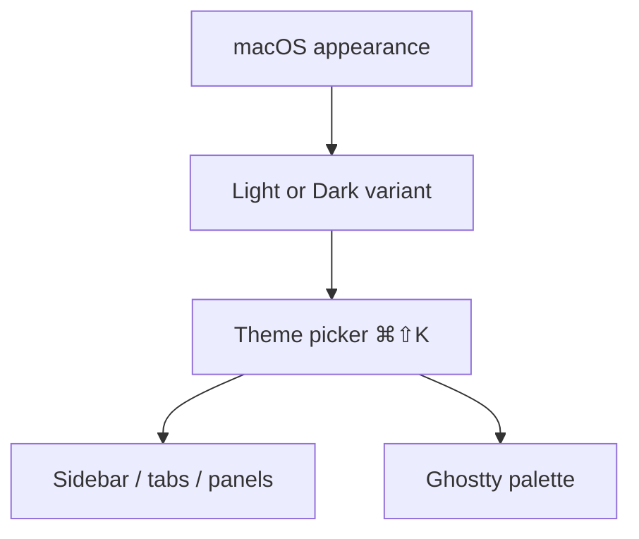

# Themes

Muxy uses a paired light / dark theme model. The chrome (sidebar, tabs, panels) and the terminal share the same color palette so everything stays visually consistent.

## Theme picker

Open with `⌘⇧K` (or click the theme button in the topbar). Muxy stores separate choices for:

- **Light Terminal Theme**
- **Dark Terminal Theme**

The active variant follows macOS appearance automatically, so your dark choice and light choice are remembered independently.

## Sidebar vibrancy

Toggle **Sidebar Vibrancy** in **Settings → Interface → Sidebar**. It is on by default and uses a theme-tinted native macOS material across the sidebar and its traffic-light/title strip. Turn it off for a solid theme background. The main topbar and all terminal, browser, extension, panel, and sheet content keep the selected theme background.

Muxy temporarily falls back to the solid background in full screen and when macOS **Reduce transparency** or **Increase contrast** is enabled.

## Ghostty colors

Terminal colors come from Muxy's [Ghostty config](terminal.md#configuration). When you change theme in Muxy, the matching light/dark variant is applied automatically. To customise the palette directly, edit the config — see [Ghostty's theme docs](https://ghostty.org/docs/config/reference#theme).

## Reload

After editing Muxy's Ghostty config, **Muxy -> Reload Configuration** (`⌘⇧R`) re-reads it without restarting.
